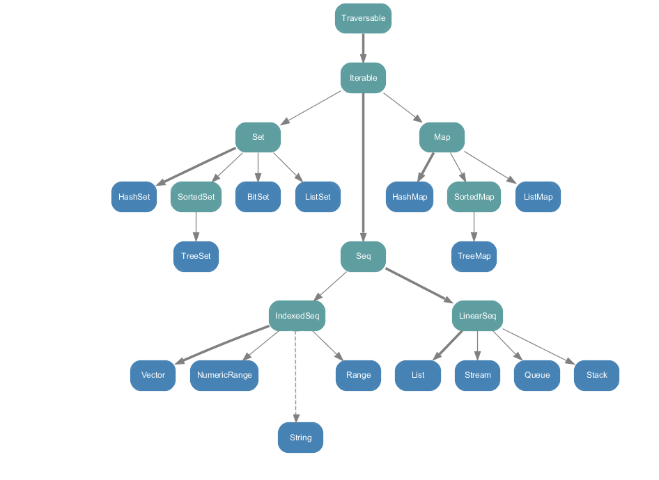

# 如何在 Scala 中科学地操作 collection

在日常项目开发中，我们几乎都会用到Scala中的集合以及一些集合操作。由于 Scala 中的集合操作灵活多变，对于刚接触Scala的开发者，在选用何种集合以及使用何种集合操作就显得不那么合理了，虽然大部分时候都可以解决问题，但是有时候并没有选择最优的方式。科学合理地操作Scala中的集合可以使我们的代码变得更加简洁和高效。

## Mutable 和 Immutable 集合

Scala 集合类系统地区分了可变的和不可变的集合。

### scala.collection 包中所有的集合类


### scala.collection.mutable 中的所有集合类
`可变集合`，顾名思义，意味着你可以修改，移除或者添加一个元素。


### scala.collection.immutable 中的所有集合类
`不可变集合`，相比`可变集合`，`不可变集`合永远不会被改变，但是你仍然可以像`可变集合`那样操作（修改，添加，删除某个集合元素）`不可变集合`，只是这些操作在每一种情况下都是返回一个新的集合，同时，原来的集合不会发生改变，由于此特性，`不可变集合`也是线程安全的，Scala在默认情况下采用的是`不可变集合`。所以在使用上，优先使用`不可变集合`。`不可变集`合适用于大多数情况。




## 不同集合的使用场景

其中常用的集合有三种：`List`，`Set`，`Map`。

### 列表 List

`List` 继承至 `Seq`，集合中的元素是可以重复的。

e.g.
```scala
scala> val l = List(1, 1, 2, 2, 3, 5)
l: List[Int] = List(1, 1, 2, 2, 3, 5)
```

所以当集合内的元素是可重复的时候，可以选择 `List` 或者 `Seq`。

### 集 Set

`Set` 中的元素是不可重复的。

e.g.
```scala
scala> val s = Set(1, 1, 2, 2, 3, 5)
s: scala.collection.immutable.Set[Int] = Set(1, 2, 3, 5)
```

所以当集合内的元素是不可重复的时候，选择 `Set`。

### 映射 Map

`Map` 中的元素呈现 `key -> value` 的形式，其中第一个参数是映射的键，第二个参数是映射的值。且Map中每一个元素的键是唯一的。

e.g.
```scala
scala> val m = Map(1 -> 1, 1 -> 3, 2 -> 3, 3 -> 4, 4 -> 4, 5 -> 7)
m: scala.collection.immutable.Map[Int,Int] = Map(5 -> 7, 1 -> 3, 2 -> 3, 3 -> 4, 4 -> 4)
```

所以当集合中的元素是 `key -> value` 的形式且每个元素的键不重复的时候，选择 `Map`。

## 集合中方法的使用

### 各集合操作之间的比较

在开始介绍不同方法的使用场景之前，我们先对比一下不同方法操作同一集合所产出的结果有何异同。

* `map`、`filter`、`collect` 的比较

```scala
//定义一个列表
scala> val l = List(1, 2, 3, 4, 5)
l: List[Int] = List(1, 2, 3, 4, 5)

//map操作
scala> l.map(_ * 2)
res0: List[Int] = List(2, 4, 6, 8, 10)

//filter操作
scala> l.filter(_ > 2)
res3: List[Int] = List(3, 4, 5)

//collect操作
scala> l.collect {case i if i > 2 => i * 2}
res1: List[Int] = List(6, 8, 10)
```
通过以上结果对比我们可以看到：

`map` 操作得到的集合，除了元素个数和原集合一样，其他都不一样。

`filter` 操作得到的集合是原集合的子集。

`collect` 操作得到的集合虽然和原集合不一样，但是仔细观察，可以看到 `collect` 操作得到的结果是 `map` 操作得到结果的子集，而且元素的个数和 `filter` 操作得到的集合元素个数相同。

* `flatten` 和 `flatMap` 的比较

```scala
//定义一个列表
scala> val l = List(List(1, 2, 3), List(4, 5, 6), Seq(7, 8, 9))
l: List[Seq[Int]] = List(List(1, 2, 3), List(4, 5, 6), List(7, 8, 9))

//flatten操作
scala> l.flatten
res5: List[Int] = List(1, 2, 3, 4, 5, 6, 7, 8, 9)

//flatMap操作
scala> l.flatMap(i => i.map(_ * 2))
res6: List[Int] = List(2, 4, 6, 8, 10, 12, 14, 16, 18)
```
通过以上结果我们可以看到，`flatten` 和 `flatMap` 都可可以将嵌套结构扁平化为一个层次的集合，但是：

`flatten` 仅仅是将嵌套结构扁平化了，并没有改变原来集合内层列表中元素的值。

`flatMap` 不仅将嵌套结构扁平化了，而且改变了原来集合内层列表中元素的值，其实 `flatMap` 就是在 `flatten` 之后再做一个 `map` 操作。

补充：以上操作返回的都是一个批量的结果，如果要查找某一特定元素，则可以采用类比的方法：

`filter` -> `find`

`collect` -> `collectFirst`

### 不同方法的使用场景

通过以上对比，我们对集合中常用方法的操作结果有了一个大致的认识，接下来我们看看在不同场景下如何科学地选择相应的集合操作。

我们先定义一些将要在后面场景中使用的数据结构：

```scala
case class Student(
  name: String,
  age: Int,
  sex: String
)
val jilen = Student(
  name = "Jilen",
  age = 30,
  sex = "m"
)
val shaw = Student(
  name = "Shaw",
  age = 18,
  sex = "m"
)
val yison = Student(
  name = "Yison",
  age = 40,
  sex = "f"
)
val l = List(jilen, shaw, yison)
l: List[Student] = List(Student(Jilen,30,m), Student(Shaw,18,m), Student(Yison,40,f))
```
如上，我们定义了一个学生组成的列表。

#### 场景一：我们要得到这些学生姓名所组成的列表

分析：学生姓名所组成的列表和原列表（学生列表）是不同的，是一个全新的列表，所以这里选用 `map`

```scala
val nameList = l.map(_.name)
nameList: List[String] = List(Jilen, Shaw, Yison)
```
`map` 是对集合中的每个元素应用一个函数，返回应用后的元素所组成的集合，通常情况下，map所返回的集合和原集合是是不同类型的集合，也就是一个全新的集合。

#### 场景二：我们要得到所有性别是男（m）的学生所组成的列表

分析：得到的列表还是学生列表，并且该列表是原列表的子集，因为有一个附加条件：男性学生，所以这里选用 `filter`

```scala
val maleList = l.filter(_.sex == "m")
maleList: List[Student] = List(Student(Jilen,30,m), Student(Shaw,18,m))
```
`filter` 一般用于移除集合中不满足条件的元素，返回满足条件的元素所组成的集合。
当然，这里用 `collect` 也可以解决问题：

```scala
val maleList = l.collect{case s if s.sex == "m" => s}
maleList: List[Student] = List(Student(Jilen,30,m), Student(Shaw,18,m))
```
但是对比一下，可以发现filter更加简洁。

#### 场景三： 我们要得到男学生姓名所组成的列表

分析：要得到男学生姓名，我们首先要得到男学生，然后再去获取这些学生的姓名，所以我们很容易采用：

```scala
val maleNameList = l.filter(_.sex == "m").map(_.name)
maleNameList: List[String] = List(Jilen, Shaw)
```
但是通过我们在之前`各集合操作之间的比较`中所得出的结论，由于男学生姓名列表是一个和原列表（学生列表）完全不同的，并且该列表是学生姓名列表的子集，所以我们可以采用 `collect`：

```scala
val maleNameList = l.collect{case s if s.sex == "m" => s.name}
maleNameList: List[String] = List(Jilen, Shaw)
```
得到的结果和上面操作的结果一样。

`collect` 接受的是一个偏函数，对集合中每个元素应用该函数，返回应用后的元素所组成的列表，可以将 `collect` 看作是先做 `filter` 操作再做 `map` 操作：

场景二中的 `collect` 操作可以看作是：

```scala
l.filter(_.sex == "m").map(s => s)
List[Student] = List(Student(Jilen,30,m), Student(Shaw,18,m))
```

### 其他常用方法

#### 场景四：现在我们要得到每个学生在列表中的位置以方便给他们编号

分析：我们可以采用 `学生 -> 编号` 的形式来组织学生与编号之前的关系，这里我们可以采用 `zipWithIndex`：

```scala
l.zipWithIndex
List[(Student, Int)] = List((Student(Jilen,30,m),0), (Student(Shaw,18,m),1),(Student(Yison,40,f),2))
```


`zipWithIndex` 将可以将集合内的元素与该元素在集合中的位置组合在一起，其实就是将集合内的元素与该元素的位置组成了一个元组，元组的第二个值是元素在集合中所处的位置。


#### 场景五：现在要将男学生和女学生分组，男学生组成一个集合，女学生组成一个集合

分析：根据场景的描述，新集合内的元素应该是：`sex -> List[Student]`的形式，这里我们可以采用：`groupBy`：

```scala
val group = l.groupBy(_.sex)
group: scala.collection.immutable.Map[String,List[Student]] = Map(m -> List(Student(Jilen,30,m), Student(Shaw,18,m)), f -> List(Student(Yison,40,f)))
```

`groupBy` 就是对集合按照特定的要求进行分组，返回一个 `Map`类型。


## 延伸阅读
[Scala Collections Tips and Tricks](https://pavelfatin.com/scala-collections-tips-and-tricks/)

[集合](https://twitter.github.io/scala_school/zh_cn/collections.html)
