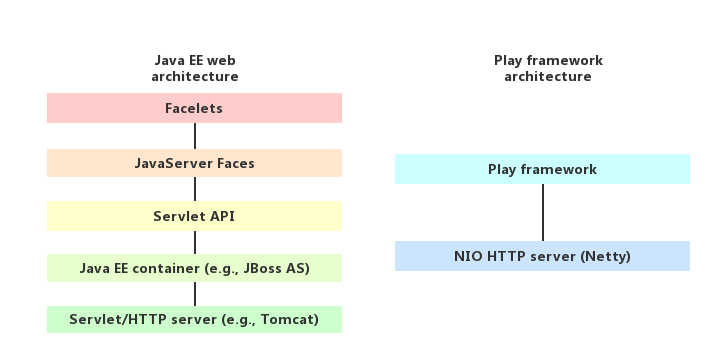

`Play!` 是一种高效率的 Java 和 Scala Web 应用程序框架，它集成了现代 Web 应用程序开发所需的组件和 API。本文将介绍一下 `Play!` 的基本性质以及利用该框架开发 Web 程序的优势。

## Play! Framework 技术栈


从上图可以看到 `Play!` 是一个全栈（full-stack）式 Web 框架，它提供了诸如开发、测试、发布等一系列工具以及插件的支持。接下来我们就 `Play!` 的几个比较突出的特点进行介绍。

## 开发效率高



通过上图可以对比一下 `Play!` 与传统的 `Java EE` 框架的区别，可以看到 `Play!` 在架构上更加清晰简洁。在 `Play!`之前， 相比于 [ROR （Ruby on Rails）](https://en.wikipedia.org/wiki/Ruby_on_Rails)风格的框架，传统的 Java Web 框架在开发网页应用的时候往往耗时比较长，原因主要有两个：

1、依赖 `Servlet`

传统的 Java Web 框架都是基于 `Servlet` 来构建的，开发人员开发的应用也需要在 `Servlet` 容器中运行，但是这就带来了一个后果，开发人员每次修改完代码之后，都需要重新启动 Web 服务器才能看到修改后的效果。如果某一个项目规模较小，那重启以及编译的时间还能接受，但是如果项目很大，那开发过程中所花的大部分时间都浪费在重启以及编译上面了。

通过上图可以看到， `Play!` 抛弃了 `Servlet`，基于 `Netty` 实现了自己的 HTTP Server，解决了修改代码需要重启服务器的问题。当开发人员修改完代码之后，只需要刷新一下浏览器就可以看到修改之后的效果，从而提高了开发效率。

2、 复杂的 `XML` 配置文件

传统的 Java Web 框架在开发某个 Web 应用的时候需要引入大量的 XML 配置文件，这些文件在配置起来比较麻烦，如果数量很多且分散在不同的文件下面会使得维护成本增加。

`Play!` 框架深谙 `ROR` 之道，采用 `约定优于配置`，只有一个全局的配置文件 `application.conf`，其他大部分配置都是默认的，我们只需要按照它约定的去做好了。

## 无状态（Stateless）

`Play!` 框架抛弃了 Servlet/JSP 里 Session 等概念，在每次 HTTP Request 之间不会在 Server 端存储状态，所需的状态都需要在 HTTP Request 之间传递，这样做的好处就是使得服务器的水平扩展性增强了，比如，当系统流量过大时，我们只需要新增一个节点就可以立即增加系统的负载能力。

## RESTFul

传统的 Java Web 框架利用 Servlet 将 Http协议隐藏了起来，也就是说开发者不能很直观地看到某一个请求对应的某个操作。而 `Play!` 在设计上拥抱了 Http 协议，比如我们要获取一个用户列表，我们就可以在 `route` 文件中这样写：

```
GET      /customer/list      controllers.CustomerController.list
```

那么 `/customer/list` 这个 URL 对应的就是 `CustomerController` 中的 `list` 方法。

这样看上去更加直观。

## 异步非阻塞

由于 `Play!` 的 HTTP Server 是基于 `Netty` 实现的， 而`Netty` 具有异步高性能、高可靠性和高成熟度的优点，而且 `Play!` 的默认配置已经为 `controller` 做了优化，所以本质上，`Play!` 从里到外都是异步的。`Play!` 能够以异步，非阻塞方式处理每一个请求。另外 `Play!` 的最新版本 `Play 2.6.x` ，其 HTTP Server 是基于 `Akka HTTP` 实现的，也能很好地支持异步非阻塞。 `Play!` 通过放弃传统 Java Web 框架中的 `Servlet` 而采用自己实现的 HTTP Server，使得它在开发高性能 Web 应用时具有很大的优势。

## 强类型模板

从 `Play! 2` 开始， `Play!` 的模板就全面拥抱了 `Scala`，所以 `Play!` 的模板都是可以编译的 Scala 函数，这就意味着我们可以在编译的时候直接在浏览器或者控制台中看到模板的错误信息，而不用等到将应用部署，调用页面之后才能发现错误。
